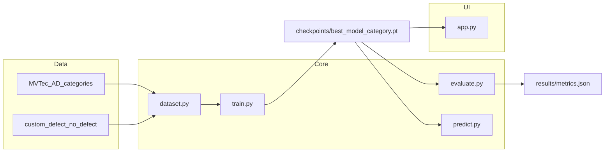

# Image Defect Detection System

Modular computer vision pipeline for **industrial defect detection**: binary **defect / no defect** classification across **15 product categories** from the [MVTec AD](https://www.mvtec.com/company/research/datasets/mvtec-ad) dataset (~5,300 images). YAML configuration controls categories, hyperparameters, and checkpoint paths so new experiments run without code changes.


## Problem

Manufacturing lines need fast, consistent visual inspection. This project turns a research-style CV pipeline into a practical tool: train per-product ResNet classifiers, save best checkpoints automatically, and let operators upload images through a Streamlit dashboard for instant defect/no-defect results with confidence scores.

## Architecture



## Results

Committed metrics in `results/metrics.json` (ResNet18, pooled random 80/20 split):

| Metric | Value |
|--------|-------|
| Categories evaluated | 15 (MVTec AD) |
| Validation accuracy range | 74.65% (capsule) – 100% (5 categories) |
| Bottle | 98.31% val acc vs 83.05% majority baseline (+15.25 pts, n=59) |
| Categories at 100% val acc | hazelnut, leather, metal_nut, tile, zipper |
| Backbone | ResNet18 (ImageNet transfer learning) |

**Note:** Metrics use a random 80/20 train/val split of the pooled MVTec train+test images. This is binary image classification, not the official MVTec AD anomaly-detection benchmark (segmentation / AUROC). Regenerating metrics (including precision/recall/F1) requires local MVTec data and checkpoints.

Reproduce metrics locally:

```bash
python -m src.evaluate --all-categories
```

## Quick start (dashboard)

```bash
git clone https://github.com/mercuriorenau/deeplearning-imagedefect-detection.git
cd deeplearning-imagedefect-detection
pip install -r requirements.txt
```

1. Download pretrained checkpoints from [Google Drive](https://drive.google.com/drive/folders/1Jfb5n2jWxqK3dj53txmfDxw4keKp9y-K?usp=sharing).
2. Place `.pt` files in `checkpoints/` (e.g. `best_model_bottle.pt`).
3. Run the dashboard:

```bash
streamlit run app.py
```

Or with Docker (checkpoints mounted from the host; not a public demo):

```bash
mkdir -p checkpoints
# place best_model_*.pt files in checkpoints/
docker compose up --build
```

Then open http://localhost:8501.

Select a product category, upload an image, and view the prediction. Reference examples ship in `examples/` so the UI works without the full dataset.

## Requirements

- Python 3.8+
- CUDA optional (CPU inference supported)

## Dataset layout

### Option A: MVTec AD (recommended)

Place MVTec categories directly under `data/` — no copying or renaming. See [data/README.md](data/README.md).

```
data/
  bottle/
    train/good/
    test/good/
    test/broken_large/
    ...
  cable/
    ...
```

In `config.yaml`:

```yaml
data:
  mvtec_root: "data"
  mvtec_category: "bottle"
```

Train one category:

```bash
python -m src.train --category bottle
```

Train all 15 categories (saves `checkpoints/best_model_<category>.pt`):

```bash
python -m src.train --all-categories
```

### Option B: Custom folders

```
data/
  train/
    defect/
    no_defect/
  val/
    defect/
    no_defect/
```

Set `mvtec_root` to empty or remove it from config and use default `train_dir` / `val_dir`.

This repository does **not** include the full MVTec dataset or model checkpoints (download checkpoints from Drive above).

## Predict (CLI)

```bash
python -m src.predict path/to/image.jpg --checkpoint checkpoints/best_model_bottle.pt
python -m src.predict img1.jpg img2.png
python -m src.predict data/bottle/test/broken_large/
```

## Config

Edit `config.yaml` to change:

- **model.name**: `resnet18`, `resnet34`, or `resnet50`
- **training**: `batch_size`, `epochs`, `learning_rate`
- **model.freeze_backbone_epochs**: epochs with frozen backbone before fine-tuning
- **data.split_mode**: `pooled_random` (default; matches committed `results/metrics.json`) or `official_holdout` (train on `train/good` + a portion of test defects; evaluate on held-out `test/`). Switching to `official_holdout` requires a full retrain before metrics are comparable.

## Latency benchmark

Download at least one checkpoint, then:

```bash
python scripts/benchmark_latency.py
```

Writes mean / p50 / p95 latency (ms) and peak RSS to `results/latency.json`. Uses a synthetic 224×224 tensor (no dataset required).

## Project structure

```
Image Defect Detection/
  app.py                  # Streamlit operator dashboard
  config.yaml             # Paths and hyperparameters
  requirements.txt
  Dockerfile              # Local Streamlit container
  docker-compose.yml      # Mounts checkpoints/ and examples/
  .github/workflows/ci.yml
  checkpoints/            # Saved models (download separately)
  examples/               # One good + defect image per category (for UI)
  results/                # Evaluation metrics JSON
  scripts/
    copy_example_images.py
    benchmark_latency.py
  data/                   # MVTec AD or custom dataset (not in repo)
  src/
    dataset.py            # DataLoaders and transforms
    model.py              # ResNet transfer learning
    train.py              # Training
    predict.py            # Inference
    evaluate.py           # Validation metrics (accuracy, P/R/F1, confusion matrix)
    metrics_utils.py      # Pure-Python metric helpers
  tests/
    test_smoke.py
    test_metrics_utils.py
  docs/
    RECOMMENDED_DATASETS.md
```

## Tech stack

- **PyTorch** — model and training
- **TorchVision** — pretrained ResNet (ImageNet)
- **Streamlit** — operator dashboard
- **YAML** — experiment configuration

## Tests

```bash
pytest tests/ -v
```

## License

MIT — see [LICENSE](LICENSE).

## Repository

[mercuriorenau/deeplearning-imagedefect-detection](https://github.com/mercuriorenau/deeplearning-imagedefect-detection)
